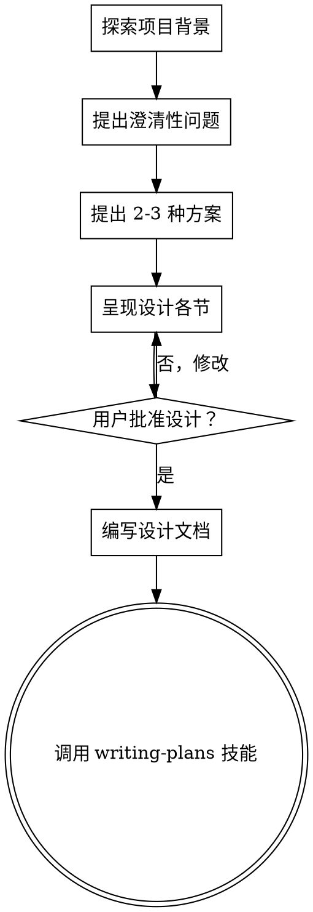

# 将想法转化为设计

## 概述

通过自然的协作对话，帮助将想法转化为完整的设计和规范。

首先了解当前项目背景，然后逐一提出问题以完善想法。一旦理解了要构建的内容，提出设计并获得用户批准。

<HARD-GATE>
在提出设计并得到用户批准之前，不得调用任何实现技能、编写任何代码、搭建任何项目或采取任何实现行动。无论项目看起来多么简单，此规则适用于每个项目。
</HARD-GATE>

## 反模式："这太简单了，不需要设计"

每个项目都要经历这个流程。待办事项列表、单函数工具、配置更改——全都如此。"简单"的项目恰恰是未经审视的假设导致最多无用功的地方。对于真正简单的项目，设计可以很短（几句话），但你必须提出设计并获得批准。

## 检查清单

你必须为以下每一项创建任务，并按顺序完成：

1. **探索项目背景** — 检查文件、文档、最近的提交
2. **提出澄清性问题** — 每次一个，了解目的/约束/成功标准
3. **提出 2-3 种方案** — 包含权衡分析和你的推荐
4. **呈现设计** — 按复杂度分节呈现，每节后获得用户批准
5. **编写设计文档** — 保存到 `docs/plans/YYYY-MM-DD-<topic>-design.md` 并提交
6. **过渡到实现** — 调用 writing-plans 技能创建实现计划

## 流程图

**终止状态是调用 writing-plans。** 不得调用 frontend-design、mcp-builder 或任何其他实现技能。头脑风暴之后唯一调用的技能是 writing-plans。

## 流程详解

**理解想法：**
- 首先查看当前项目状态（文件、文档、最近提交）
- 逐一提出问题以完善想法
- 尽可能使用多选题，开放式问题也可以
- 每条消息只问一个问题——如果某个主题需要更多探讨，将其拆分为多个问题
- 重点理解：目的、约束、成功标准

**探索方案：**
- 提出 2-3 种不同方案及其权衡
- 以对话方式呈现选项，附上你的推荐和理由
- 以你推荐的选项为首，并解释原因

**呈现设计：**
- 一旦你认为理解了要构建的内容，就呈现设计
- 根据复杂度调整每节篇幅：简单内容几句话，复杂内容最多 200-300 字
- 每节结束后询问目前是否正确
- 涵盖：架构、组件、数据流、错误处理、测试
- 如有不清楚的地方，随时返回澄清

## 设计之后

**文档记录：**
- 将验证后的设计写入 `docs/plans/YYYY-MM-DD-<topic>-design.md`
- 如果可用，使用 elements-of-style:writing-clearly-and-concisely 技能
- 将设计文档提交到 git

**实现：**
- 调用 writing-plans 技能创建详细的实现计划
- 不得调用任何其他技能。writing-plans 是下一步。

## 核心原则

- **每次一个问题** — 不要用多个问题淹没对方
- **优先多选题** — 尽可能比开放式问题更容易回答
- **彻底践行 YAGNI** — 从所有设计中删除不必要的功能
- **探索替代方案** — 在确定方案前始终提出 2-3 种方法
- **增量验证** — 呈现设计，在继续前获得批准
- **保持灵活** — 遇到不合理之处时返回澄清
