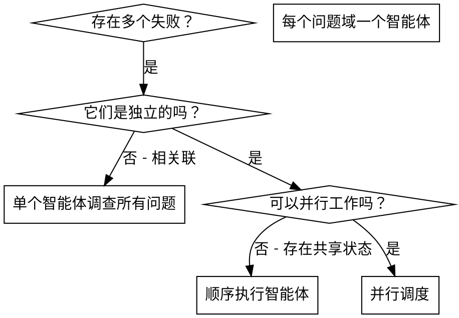

# 调度并行智能体

## 概述

当你有多个互不相关的失败情况（不同的测试文件、不同的子系统、不同的 bug），按顺序逐一调查会浪费时间。每个调查都是独立的，可以并行进行。

**核心原则：** 每个独立的问题域分配一个智能体，让它们并发工作。

## 使用时机



**适用情况：**
- 3 个或更多测试文件因不同根本原因失败
- 多个子系统独立损坏
- 每个问题无需依赖其他问题的上下文即可理解
- 调查之间没有共享状态

**不适用情况：**
- 失败之间存在关联（修复一个可能修复其他）
- 需要了解完整系统状态
- 智能体之间会相互干扰

## 模式

### 1. 识别独立域

按损坏内容对失败进行分组：
- 文件 A 的测试：工具审批流程
- 文件 B 的测试：批次完成行为
- 文件 C 的测试：中止功能

每个域是独立的——修复工具审批不会影响中止测试。

### 2. 创建专注的智能体任务

每个智能体获得：
- **特定范围：** 一个测试文件或子系统
- **明确目标：** 使这些测试通过
- **约束条件：** 不更改其他代码
- **预期输出：** 你发现和修复内容的摘要

### 3. 并行调度

```typescript
// 在 Claude Code / AI 环境中
Task("修复 agent-tool-abort.test.ts 的失败")
Task("修复 batch-completion-behavior.test.ts 的失败")
Task("修复 tool-approval-race-conditions.test.ts 的失败")
// 三个任务并发运行
```

### 4. 审查和集成

智能体返回结果后：
- 阅读每个摘要
- 验证修复之间不冲突
- 运行完整测试套件
- 集成所有更改

## 智能体提示结构

好的智能体提示具备：
1. **专注性** - 一个清晰的问题域
2. **自包含性** - 理解问题所需的所有上下文
3. **明确的输出要求** - 智能体应返回什么？

```markdown
修复 src/agents/agent-tool-abort.test.ts 中的 3 个失败测试：

1. "should abort tool with partial output capture" - 期望消息中包含 'interrupted at'
2. "should handle mixed completed and aborted tools" - 快速工具被中止而非完成
3. "should properly track pendingToolCount" - 期望 3 个结果但得到 0

这些是时序/竞态条件问题。你的任务：

1. 读取测试文件并理解每个测试验证的内容
2. 找出根本原因——是时序问题还是实际 bug？
3. 修复方法：
   - 将任意超时替换为基于事件的等待
   - 如果发现中止实现中的 bug，修复它
   - 如果测试行为已更改，调整测试预期

不要仅仅增加超时时间——找到真正的问题。

返回：你发现了什么以及你修复了什么的摘要。
```

## 常见错误

**范围太广：** "修复所有测试"——智能体会迷失方向
**正确做法：** "修复 agent-tool-abort.test.ts"——专注的范围

**缺乏上下文：** "修复竞态条件"——智能体不知道在哪里
**正确做法：** 粘贴错误信息和测试名称

**没有约束：** 智能体可能重构所有内容
**正确做法：** "不要更改生产代码"或"仅修复测试"

**输出模糊：** "修复它"——你不知道什么发生了变化
**正确做法：** "返回根本原因和更改内容的摘要"

## 不应使用的情况

**相关失败：** 修复一个可能修复其他——先一起调查
**需要完整上下文：** 理解需要查看整个系统
**探索性调试：** 你还不知道什么损坏了
**共享状态：** 智能体会相互干扰（编辑相同文件，使用相同资源）

## 会话中的真实示例

**场景：** 大规模重构后，3 个文件中出现 6 个测试失败

**失败情况：**
- agent-tool-abort.test.ts：3 个失败（时序问题）
- batch-completion-behavior.test.ts：2 个失败（工具未执行）
- tool-approval-race-conditions.test.ts：1 个失败（执行计数 = 0）

**决策：** 独立域——中止逻辑与批次完成和竞态条件各自独立

**调度：**
```
智能体 1 → 修复 agent-tool-abort.test.ts
智能体 2 → 修复 batch-completion-behavior.test.ts
智能体 3 → 修复 tool-approval-race-conditions.test.ts
```

**结果：**
- 智能体 1：将超时替换为基于事件的等待
- 智能体 2：修复事件结构 bug（threadId 位置错误）
- 智能体 3：添加等待异步工具执行完成的逻辑

**集成：** 所有修复相互独立，无冲突，完整套件通过

**节省时间：** 3 个问题并行解决，而非按顺序逐一处理

## 主要优势

1. **并行化** - 多个调查同时进行
2. **专注性** - 每个智能体范围较窄，需要跟踪的上下文更少
3. **独立性** - 智能体之间互不干扰
4. **速度** - 用解决 1 个问题的时间解决 3 个问题

## 验证

智能体返回后：
1. **审查每个摘要** - 了解发生了什么变化
2. **检查冲突** - 智能体是否编辑了相同的代码？
3. **运行完整套件** - 验证所有修复协同工作
4. **抽查** - 智能体可能会产生系统性错误

## 实际影响

来自调试会话（2025-10-03）：
- 3 个文件中共 6 个失败
- 3 个智能体并行调度
- 所有调查并发完成
- 所有修复成功集成
- 智能体更改之间零冲突
