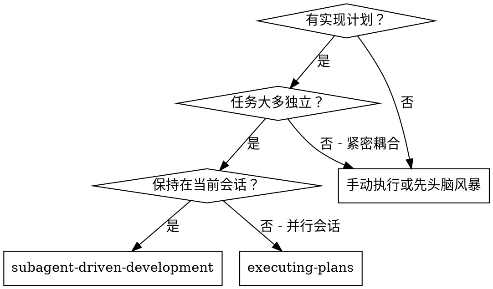
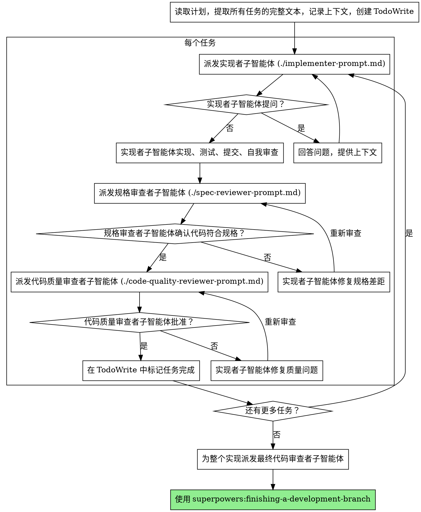

# 子智能体驱动开发

通过为每个任务派发独立的子智能体来执行计划，每个任务完成后进行两阶段审查：先进行规格符合性审查，再进行代码质量审查。

**核心原则：** 每个任务使用独立子智能体 + 两阶段审查（规格符合性，然后是代码质量）= 高质量、快速迭代

## 适用场景



**与"执行计划"（并行会话）的对比：**
- 同一会话（无需切换上下文）
- 每个任务使用独立子智能体（无上下文污染）
- 每个任务完成后进行两阶段审查：先规格符合性，再代码质量
- 更快的迭代（任务间无需人工介入）

## 流程



## 提示模板

- `./implementer-prompt.md` - 派发实现者子智能体
- `./spec-reviewer-prompt.md` - 派发规格符合性审查者子智能体
- `./code-quality-reviewer-prompt.md` - 派发代码质量审查者子智能体

## 示例工作流

```
您：我正在使用子智能体驱动开发来执行此计划。

[一次性读取计划文件：docs/plans/feature-plan.md]
[提取所有 5 个任务的完整文本和上下文]
[使用所有任务创建 TodoWrite]

任务 1：Hook 安装脚本

[获取任务 1 的文本和上下文（已提取）]
[带着完整任务文本和上下文派发实现子智能体]

实现者："在开始之前——hook 应该安装在用户级别还是系统级别？"

您："用户级别 (~/.config/superpowers/hooks/)"

实现者："明白了。正在实现..."
[之后] 实现者：
  - 实现了 install-hook 命令
  - 添加了测试，5/5 通过
  - 自我审查：发现遗漏了 --force 标志，已添加
  - 已提交

[派发规格符合性审查者]
规格审查者：✅ 符合规格 - 所有需求已满足，无多余内容

[获取 git SHA，派发代码质量审查者]
代码审查者：优点：测试覆盖率良好，代码整洁。问题：无。已批准。

[标记任务 1 完成]

任务 2：恢复模式

[获取任务 2 的文本和上下文（已提取）]
[带着完整任务文本和上下文派发实现子智能体]

实现者：[无问题，直接进行]
实现者：
  - 添加了验证/修复模式
  - 8/8 测试通过
  - 自我审查：一切正常
  - 已提交

[派发规格符合性审查者]
规格审查者：❌ 发现问题：
  - 缺失：进度报告（规格说明"每 100 个项目报告一次"）
  - 多余：添加了 --json 标志（未在需求中）

[实现者修复问题]
实现者：删除了 --json 标志，添加了进度报告

[规格审查者重新审查]
规格审查者：✅ 现在符合规格

[派发代码质量审查者]
代码审查者：优点：扎实。问题（重要）：魔法数字（100）

[实现者修复]
实现者：提取了 PROGRESS_INTERVAL 常量

[代码审查者重新审查]
代码审查者：✅ 已批准

[标记任务 2 完成]

...

[所有任务完成后]
[派发最终代码审查者]
最终审查者：所有需求已满足，可以合并

完成！
```

## 优势

**与手动执行相比：**
- 子智能体自然遵循 TDD
- 每个任务使用独立上下文（无混淆）
- 并行安全（子智能体互不干扰）
- 子智能体可以提问（工作前和工作中均可）

**与"执行计划"相比：**
- 同一会话（无需交接）
- 持续推进（无需等待）
- 自动设置审查检查点

**效率提升：**
- 无文件读取开销（控制器提供完整文本）
- 控制器精确整理所需上下文
- 子智能体预先获得完整信息
- 问题在工作开始前提出（而非之后）

**质量把关：**
- 自我审查在交接前发现问题
- 两阶段审查：规格符合性，然后是代码质量
- 审查循环确保修复实际有效
- 规格符合性审查防止过度或不足构建
- 代码质量审查确保实现构建良好

**成本：**
- 更多子智能体调用（每个任务：实现者 + 2 名审查者）
- 控制器需要更多准备工作（预先提取所有任务）
- 审查循环增加迭代次数
- 但能早期发现问题（比后期调试更便宜）

## 警示信号

**绝不：**
- 未经用户明确同意就在 main/master 分支上开始实现
- 跳过审查（规格符合性审查或代码质量审查）
- 带着未修复的问题继续推进
- 并行派发多个实现子智能体（会产生冲突）
- 让子智能体读取计划文件（改为提供完整文本）
- 跳过场景设置上下文（子智能体需要了解任务在哪里适配）
- 忽视子智能体的问题（在让他们继续之前先回答）
- 对规格符合性接受"差不多"（审查者发现问题 = 未完成）
- 跳过审查循环（审查者发现问题 = 实现者修复 = 再次审查）
- 让实现者自我审查替代实际审查（两者都需要）
- **在规格符合性审查通过 ✅ 之前开始代码质量审查**（顺序错误）
- 在任何审查有未解决问题时进入下一个任务

**如果子智能体提问：**
- 清晰完整地回答
- 如有需要，提供额外上下文
- 不要催促他们进入实现阶段

**如果审查者发现问题：**
- 实现者（同一子智能体）修复问题
- 审查者再次审查
- 重复直到批准
- 不要跳过重新审查

**如果子智能体任务失败：**
- 带着具体指令派发修复子智能体
- 不要尝试手动修复（会造成上下文污染）

## 集成

**所需工作流技能：**
- **superpowers:using-git-worktrees** - 必需：开始前设置隔离工作区
- **superpowers:writing-plans** - 创建此技能执行的计划
- **superpowers:requesting-code-review** - 审查者子智能体的代码审查模板
- **superpowers:finishing-a-development-branch** - 所有任务完成后收尾开发

**子智能体应使用：**
- **superpowers:test-driven-development** - 子智能体为每个任务遵循 TDD

**替代工作流：**
- **superpowers:executing-plans** - 用于并行会话而非同会话执行
