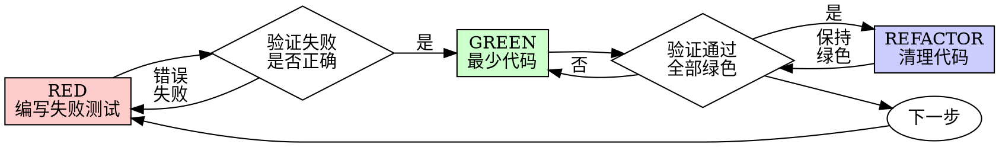

# 测试驱动开发（TDD）

## 概述

先写测试。看它失败。写最少的代码来通过测试。

**核心原则：** 如果你没有亲眼看到测试失败，你就不知道它是否测试了正确的内容。

**违反规则的字面意义就是违反规则的精神。**

## 何时使用

**始终：**
- 新功能
- 缺陷修复
- 重构
- 行为变更

**例外情况（询问你的人类伙伴）：**
- 一次性原型
- 生成的代码
- 配置文件

想着"这次跳过 TDD"？停下来。那是在给自己找借口。

## 铁律

```
没有失败的测试，就不写生产代码
```

先写了代码再写测试？删掉它。重新开始。

**没有例外：**
- 不要把它留作"参考"
- 不要在写测试时"调整"它
- 不要看它
- 删除就是彻底删除

从测试出发全新实现。就这样。

## 红-绿-重构



### RED - 编写失败测试

写一个最小的测试，展示期望发生的事情。

<Good>
```typescript
test('retries failed operations 3 times', async () => {
  let attempts = 0;
  const operation = () => {
    attempts++;
    if (attempts < 3) throw new Error('fail');
    return 'success';
  };

  const result = await retryOperation(operation);

  expect(result).toBe('success');
  expect(attempts).toBe(3);
});
```
名称清晰，测试真实行为，只测一件事
</Good>

<Bad>
```typescript
test('retry works', async () => {
  const mock = jest.fn()
    .mockRejectedValueOnce(new Error())
    .mockRejectedValueOnce(new Error())
    .mockResolvedValueOnce('success');
  await retryOperation(mock);
  expect(mock).toHaveBeenCalledTimes(3);
});
```
名称模糊，测试的是模拟而非代码
</Bad>

**要求：**
- 测试一个行为
- 名称清晰
- 使用真实代码（除非无法避免，否则不用模拟）

### 验证 RED - 看它失败

**必须执行。绝不跳过。**

```bash
npm test path/to/test.test.ts
```

确认：
- 测试失败（而非报错）
- 失败信息符合预期
- 因功能缺失而失败（不是因为拼写错误）

**测试通过了？** 你在测试已有的行为。修改测试。

**测试报错了？** 修复错误，重新运行，直到正确失败。

### GREEN - 最少代码

写最简单的代码来通过测试。

<Good>
```typescript
async function retryOperation<T>(fn: () => Promise<T>): Promise<T> {
  for (let i = 0; i < 3; i++) {
    try {
      return await fn();
    } catch (e) {
      if (i === 2) throw e;
    }
  }
  throw new Error('unreachable');
}
```
刚好足够通过测试
</Good>

<Bad>
```typescript
async function retryOperation<T>(
  fn: () => Promise<T>,
  options?: {
    maxRetries?: number;
    backoff?: 'linear' | 'exponential';
    onRetry?: (attempt: number) => void;
  }
): Promise<T> {
  // YAGNI
}
```
过度设计
</Bad>

不要添加功能、重构其他代码，或在测试之外"改进"。

### 验证 GREEN - 看它通过

**必须执行。**

```bash
npm test path/to/test.test.ts
```

确认：
- 测试通过
- 其他测试仍然通过
- 输出干净（无错误、无警告）

**测试失败了？** 修改代码，不要修改测试。

**其他测试失败了？** 立即修复。

### REFACTOR - 清理代码

仅在绿色之后：
- 消除重复
- 改善命名
- 提取辅助函数

保持测试绿色。不要添加行为。

### 重复

为下一个功能写下一个失败测试。

## 好的测试

| 质量 | 好 | 坏 |
|------|----|-----|
| **最小化** | 只测一件事。名称中有"和"？拆分它。 | `test('validates email and domain and whitespace')` |
| **清晰** | 名称描述行为 | `test('test1')` |
| **展示意图** | 演示期望的 API | 模糊代码应该做什么 |

## 为何顺序很重要

**"我会在之后写测试来验证它是否有效"**

在代码之后写的测试会立即通过。立即通过什么都证明不了：
- 可能测试了错误的内容
- 可能测试的是实现，而非行为
- 可能遗漏了你忘记的边界情况
- 你从未见过它捕获缺陷

先写测试迫使你看到测试失败，证明它确实在测试某些东西。

**"我已经手动测试了所有边界情况"**

手动测试是临时性的。你以为你测试了一切，但：
- 没有测试记录
- 代码变更时无法重新运行
- 在压力下容易遗忘用例
- "我试过时它工作了" ≠ 全面测试

自动化测试是系统性的。每次运行方式相同。

**"删除 X 小时的工作是浪费"**

沉没成本谬误。时间已经过去了。你现在的选择：
- 删除并用 TDD 重写（再花 X 小时，高置信度）
- 保留并在之后添加测试（30 分钟，低置信度，可能有缺陷）

"浪费"是保留你无法信任的代码。没有真实测试的可工作代码就是技术债务。

**"TDD 是教条主义，务实意味着适应"**

TDD 本身就是务实的：
- 在提交前发现缺陷（比调试事后问题更快）
- 防止回归（测试立即捕获破坏）
- 记录行为（测试展示如何使用代码）
- 支持重构（自由修改，测试捕获破坏）

"务实"的捷径 = 在生产中调试 = 更慢。

**"事后测试实现相同目标——这是精神而非仪式"**

不对。事后测试回答"这做什么？"先写测试回答"这应该做什么？"

事后测试受你的实现偏见影响。你测试的是你构建的东西，而非需要的东西。你验证记得的边界情况，而非发现的那些。

先写测试迫使你在实现前发现边界情况。事后测试验证你记住了一切（你没有）。

30 分钟的事后测试 ≠ TDD。你获得了覆盖率，失去了测试有效的证明。

## 常见借口

| 借口 | 现实 |
|------|------|
| "太简单了，不用测试" | 简单代码也会出错。测试只需 30 秒。 |
| "我之后会测试" | 立即通过的测试什么都证明不了。 |
| "事后测试实现相同目标" | 事后测试 = "这做什么？" 先写测试 = "这应该做什么？" |
| "已经手动测试过了" | 临时 ≠ 系统性。没有记录，无法重新运行。 |
| "删除 X 小时是浪费" | 沉没成本谬误。保留未验证的代码就是技术债务。 |
| "留作参考，先写测试" | 你会调整它。那就是事后测试。删除就是删除。 |
| "需要先探索" | 没问题。丢弃探索代码，从 TDD 开始。 |
| "难以测试 = 设计不清晰" | 听取测试的意见。难以测试 = 难以使用。 |
| "TDD 会让我慢下来" | TDD 比调试更快。务实 = 先写测试。 |
| "手动测试更快" | 手动测试无法证明边界情况。每次变更都要重新测试。 |
| "现有代码没有测试" | 你在改进它。为现有代码添加测试。 |

## 红旗 - 停止并重新开始

- 先写代码再写测试
- 实现之后才写测试
- 测试立即通过
- 无法解释测试为何失败
- "之后"添加测试
- 给自己找借口"就这一次"
- "我已经手动测试过了"
- "事后测试实现相同目的"
- "这是精神而非仪式"
- "留作参考"或"调整现有代码"
- "已经花了 X 小时，删除是浪费"
- "TDD 是教条主义，我在务实"
- "这种情况不同，因为……"

**以上所有情况都意味着：删除代码。从 TDD 重新开始。**

## 示例：缺陷修复

**缺陷：** 接受了空邮箱

**RED**
```typescript
test('rejects empty email', async () => {
  const result = await submitForm({ email: '' });
  expect(result.error).toBe('Email required');
});
```

**验证 RED**
```bash
$ npm test
FAIL: expected 'Email required', got undefined
```

**GREEN**
```typescript
function submitForm(data: FormData) {
  if (!data.email?.trim()) {
    return { error: 'Email required' };
  }
  // ...
}
```

**验证 GREEN**
```bash
$ npm test
PASS
```

**REFACTOR**
如有需要，为多个字段提取验证逻辑。

## 验证清单

在标记工作完成之前：

- [ ] 每个新函数/方法都有测试
- [ ] 在实现前看到每个测试失败
- [ ] 每个测试因预期原因失败（功能缺失，而非拼写错误）
- [ ] 写了最少的代码来通过每个测试
- [ ] 所有测试通过
- [ ] 输出干净（无错误、无警告）
- [ ] 测试使用真实代码（仅在无法避免时使用模拟）
- [ ] 覆盖了边界情况和错误情况

无法勾选所有项？你跳过了 TDD。重新开始。

## 遇到困难时

| 问题 | 解决方案 |
|------|----------|
| 不知道如何测试 | 写出期望的 API。先写断言。询问你的人类伙伴。 |
| 测试太复杂 | 设计太复杂。简化接口。 |
| 必须模拟一切 | 代码耦合度太高。使用依赖注入。 |
| 测试设置庞大 | 提取辅助函数。仍然复杂？简化设计。 |

## 调试集成

发现缺陷？写一个能重现它的失败测试。遵循 TDD 循环。测试既证明了修复，又防止了回归。

绝不在没有测试的情况下修复缺陷。

## 测试反模式

在添加模拟或测试工具时，请阅读 @testing-anti-patterns.md 以避免常见陷阱：
- 测试模拟行为而非真实行为
- 向生产类添加仅用于测试的方法
- 在不理解依赖关系的情况下进行模拟

## 最终规则

```
生产代码 → 必须先存在失败测试
否则 → 不是 TDD
```

没有你的人类伙伴的许可，不得有例外。
