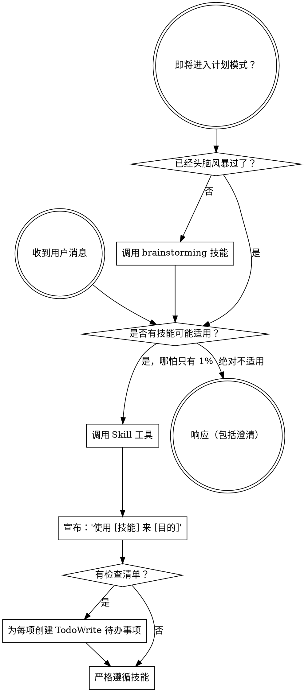

<EXTREMELY-IMPORTANT>
如果你认为某个技能甚至有 1% 的概率适用于你正在做的事情，你绝对必须调用该技能。

如果某个技能适用于你的任务，你没有选择。你必须使用它。

这不可协商。这不是可选的。你无法为自己找理由开脱。
</EXTREMELY-IMPORTANT>

## 如何访问技能

**在 Claude Code 中：** 使用 `Skill` 工具。当你调用一个技能时，其内容会被加载并呈现给你——直接遵循它。永远不要在技能文件上使用 Read 工具。

**在其他环境中：** 查看你的平台文档，了解技能是如何加载的。

# 使用技能

## 规则

**在任何响应或行动之前，调用相关或被请求的技能。** 即使只有 1% 的概率某个技能可能适用，也应该调用该技能进行检查。如果调用的技能不适合该情况，你不需要使用它。

## 危险信号

这些想法意味着停下——你在为自己找理由开脱：

| 想法 | 现实 |
|------|------|
| "这只是一个简单的问题" | 问题也是任务。检查技能。 |
| "我需要先了解更多背景" | 技能检查在澄清性问题之前。 |
| "让我先探索代码库" | 技能告诉你如何探索。先检查。 |
| "我可以快速查看 git/文件" | 文件缺乏对话背景。检查技能。 |
| "让我先收集信息" | 技能告诉你如何收集信息。 |
| "这不需要正式的技能" | 如果技能存在，就使用它。 |
| "我记得这个技能" | 技能会演进。阅读当前版本。 |
| "这不算是一个任务" | 行动 = 任务。检查技能。 |
| "这个技能太重量级了" | 简单的事情会变复杂。使用它。 |
| "我先做这一件事" | 在做任何事之前先检查。 |
| "这感觉很高效" | 无纪律的行动浪费时间。技能能防止这种情况。 |
| "我知道那是什么意思" | 了解概念 ≠ 使用技能。调用它。 |

## 技能优先级

当多个技能可能适用时，按以下顺序使用：

1. **首先是流程技能**（brainstorming、debugging）——这些决定如何处理任务
2. **其次是实现技能**（frontend-design、mcp-builder）——这些指导执行

"我们来构建 X" → 先 brainstorming，然后是实现技能。
"修复这个 bug" → 先 debugging，然后是特定领域技能。

## 技能类型

**严格型**（TDD、debugging）：严格遵循。不要随意变通纪律性要求。

**灵活型**（模式类）：将原则适配到具体情境。

技能本身会告诉你它属于哪种类型。

## 用户指令

指令说明做什么，而不是怎么做。"添加 X"或"修复 Y"不意味着可以跳过工作流程。
