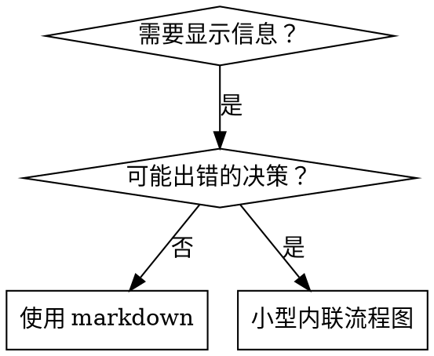

# 编写技能

## 概述

**编写技能就是将测试驱动开发（TDD）应用于流程文档。**

**个人技能存放在特定智能体的目录中（Claude Code 使用 `~/.claude/skills`，Codex 使用 `~/.agents/skills/`）**

你编写测试用例（使用子智能体的压力场景），观察其失败（基线行为），编写技能（文档），观察测试通过（智能体遵从），然后重构（堵塞漏洞）。

**核心原则：** 如果你没有亲眼看到智能体在没有该技能时失败，你就不知道该技能是否教对了东西。

**必备背景知识：** 在使用本技能之前，你必须先了解 superpowers:test-driven-development。该技能定义了基本的 红-绿-重构 循环。本技能将 TDD 应用于文档编写。

**官方指南：** 有关 Anthropic 官方技能编写最佳实践，请参见 anthropic-best-practices.md。该文档提供了补充本技能以 TDD 为核心方法的额外模式和指导原则。

## 什么是技能？

**技能**是已验证技术、模式或工具的参考指南。技能帮助未来的 Claude 实例找到并应用有效的方法。

**技能是：** 可复用的技术、模式、工具、参考指南

**技能不是：** 关于你曾经如何解决某个问题的叙述

## 技能的 TDD 对应关系

| TDD 概念 | 技能创建 |
|----------|----------|
| **测试用例** | 使用子智能体的压力场景 |
| **生产代码** | 技能文档（SKILL.md） |
| **测试失败（红色）** | 没有技能时智能体违反规则（基线） |
| **测试通过（绿色）** | 有技能时智能体遵从 |
| **重构** | 堵塞漏洞同时维持遵从性 |
| **先写测试** | 在编写技能之前运行基线场景 |
| **观察失败** | 记录智能体使用的具体理由 |
| **最小代码** | 针对具体违规行为编写技能 |
| **观察通过** | 验证智能体现在遵从 |
| **重构循环** | 发现新的理由 → 堵塞 → 重新验证 |

整个技能创建过程遵循 红-绿-重构 循环。

## 何时创建技能

**在以下情况创建：**
- 该技术对你来说并不直观
- 你会在不同项目中反复参考
- 模式具有广泛适用性（非项目特定）
- 他人会从中受益

**不要为以下情况创建：**
- 一次性解决方案
- 其他地方已有详细文档的标准实践
- 项目特定约定（放入 CLAUDE.md）
- 机械性约束（如果可以用正则/验证强制执行，则自动化——将文档留给需要判断的情况）

## 技能类型

### 技术
有步骤可循的具体方法（condition-based-waiting、root-cause-tracing）

### 模式
思考问题的方式（flatten-with-flags、test-invariants）

### 参考
API 文档、语法指南、工具文档（office docs）

## 目录结构


```
skills/
  skill-name/
    SKILL.md              # 主要参考文件（必须）
    supporting-file.*     # 仅在需要时添加
```

**扁平命名空间** - 所有技能在一个可搜索的命名空间中

**以下情况使用单独文件：**
1. **重量级参考**（100 行以上）- API 文档、综合语法
2. **可复用工具** - 脚本、实用程序、模板

**保持内联：**
- 原则和概念
- 代码模式（< 50 行）
- 其他所有内容

## SKILL.md 结构

**前言（YAML）：**
- 仅支持两个字段：`name` 和 `description`
- 最多 1024 个字符
- `name`：只使用字母、数字和连字符（无括号、特殊字符）
- `description`：第三人称，仅描述何时使用（不描述其功能）
  - 以"当...时使用"开头，聚焦于触发条件
  - 包含具体的症状、情境和上下文
  - **绝不总结技能的流程或工作流**（参见 CSO 章节了解原因）
  - 尽可能保持在 500 个字符以内

```markdown
---
name: Skill-Name-With-Hyphens
description: 当[具体触发条件和症状]时使用
---

# 技能名称

## 概述
这是什么？用 1-2 句话说明核心原则。

## 何时使用
[如果决策不明显，则添加小型内联流程图]

带有症状和用例的项目符号列表
何时不使用

## 核心模式（针对技术/模式）
前后代码对比

## 快速参考
用于扫描常见操作的表格或项目符号

## 实现
简单模式的内联代码
重量级参考或可复用工具链接到文件

## 常见错误
出现什么问题 + 修复方法

## 实际影响（可选）
具体成果
```


## Claude 搜索优化（CSO）

**发现的关键：** 未来的 Claude 需要能找到你的技能

### 1. 丰富的描述字段

**目的：** Claude 读取描述以决定为给定任务加载哪些技能。让它回答："我现在应该阅读这个技能吗？"

**格式：** 以"当...时使用"开头，聚焦于触发条件

**关键：描述 = 何时使用，而非技能的功能**

描述应仅描述触发条件。不要在描述中总结技能的流程或工作流。

**为何重要：** 测试表明，当描述总结了技能的工作流时，Claude 可能会遵循描述而不是阅读完整的技能内容。描述"任务间代码审查"导致 Claude 只做了一次审查，尽管技能的流程图清楚地显示了两次审查（规格符合性然后是代码质量）。

当描述改为仅"当执行包含独立任务的实现计划时使用"（无工作流摘要），Claude 正确读取了流程图并遵循了两阶段审查流程。

**陷阱：** 总结工作流的描述为 Claude 创造了捷径。技能主体成为 Claude 跳过的文档。

```yaml
# 差：总结工作流——Claude 可能遵循此描述而不是阅读技能
description: 执行计划时使用——为每个任务分派子智能体，任务间进行代码审查

# 差：流程细节过多
description: 用于 TDD——先写测试，观察失败，写最小代码，重构

# 好：仅触发条件，无工作流摘要
description: 当在当前会话中执行包含独立任务的实现计划时使用

# 好：仅触发条件
description: 在实现任何功能或修复错误时使用，在编写实现代码之前
```

**内容：**
- 使用具体的触发器、症状和情境来说明该技能适用的场景
- 描述*问题*（竞态条件、不一致行为）而非*特定语言的症状*（setTimeout、sleep）
- 除非技能本身是特定技术相关的，否则保持触发器与技术无关
- 如果技能是特定技术相关的，在触发器中明确说明
- 使用第三人称（注入到系统提示中）
- **绝不总结技能的流程或工作流**

```yaml
# 差：太抽象、模糊，不包含何时使用的说明
description: 用于异步测试

# 差：第一人称
description: 当测试不稳定时我可以帮助你进行异步测试

# 差：提到技术但技能并非特定于该技术
description: 当测试使用 setTimeout/sleep 且不稳定时使用

# 好：以"当...时使用"开头，描述问题，无工作流
description: 当测试存在竞态条件、时序依赖或通过/失败不一致时使用

# 好：明确触发器的特定技术技能
description: 当使用 React Router 并处理身份验证重定向时使用
```

### 2. 关键词覆盖

使用 Claude 会搜索的词语：
- 错误消息："Hook timed out"、"ENOTEMPTY"、"race condition"
- 症状："flaky"、"hanging"、"zombie"、"pollution"
- 同义词："timeout/hang/freeze"、"cleanup/teardown/afterEach"
- 工具：实际命令、库名称、文件类型

### 3. 描述性命名

**使用主动语态，动词优先：**
- 推荐 `creating-skills` 而非 `skill-creation`
- 推荐 `condition-based-waiting` 而非 `async-test-helpers`

### 4. 令牌效率（关键）

**问题：** getting-started 和频繁引用的技能会加载到每次对话中。每个令牌都很重要。

**目标字数：**
- getting-started 工作流：每个 < 150 词
- 频繁加载的技能：总计 < 200 词
- 其他技能：< 500 词（仍需简洁）

**技术：**

**将细节移至工具帮助：**
```bash
# 差：在 SKILL.md 中记录所有标志
search-conversations 支持 --text、--both、--after DATE、--before DATE、--limit N

# 好：引用 --help
search-conversations 支持多种模式和过滤器。运行 --help 查看详情。
```

**使用交叉引用：**
```markdown
# 差：重复工作流细节
搜索时，用模板分派子智能体...
[20 行重复的指令]

# 好：引用其他技能
始终使用子智能体（节省 50-100 倍上下文）。必须：使用 [other-skill-name] 进行工作流。
```

**压缩示例：**
```markdown
# 差：冗长示例（42 词）
your human partner: "我们之前是如何在 React Router 中处理身份验证错误的？"
你：我将搜索过去关于 React Router 身份验证模式的对话。
[分派子智能体，搜索查询："React Router authentication error handling 401"]

# 好：最简示例（20 词）
伙伴："我们之前如何处理 React Router 中的身份验证错误？"
你：正在搜索...
[分派子智能体 → 综合]
```

**消除冗余：**
- 不要重复交叉引用技能中已有的内容
- 不要解释命令中已明显的内容
- 不要包含相同模式的多个示例

**验证：**
```bash
wc -w skills/path/SKILL.md
# getting-started 工作流：目标 < 150 词
# 其他频繁加载：目标 < 200 词
```

**按你所做或核心洞察命名：**
- 推荐 `condition-based-waiting` > `async-test-helpers`
- 推荐 `using-skills` 而非 `skill-usage`
- 推荐 `flatten-with-flags` > `data-structure-refactoring`
- 推荐 `root-cause-tracing` > `debugging-techniques`

**动名词（-ing）适合描述流程：**
- `creating-skills`、`testing-skills`、`debugging-with-logs`
- 主动语态，描述你正在执行的动作

### 4. 交叉引用其他技能

**编写引用其他技能的文档时：**

仅使用技能名称，并带有明确的要求标记：
- 推荐：`**必要子技能：** 使用 superpowers:test-driven-development`
- 推荐：`**必备背景知识：** 你必须了解 superpowers:systematic-debugging`
- 不推荐：`参见 skills/testing/test-driven-development`（不清楚是否必须）
- 不推荐：`@skills/testing/test-driven-development/SKILL.md`（强制加载，消耗上下文）

**为何不用 @ 链接：** `@` 语法会立即强制加载文件，在你需要之前就消耗 200k+ 的上下文。

## 流程图使用



**仅在以下情况使用流程图：**
- 非明显的决策点
- 可能过早停止的流程循环
- "何时使用 A 与 B"的决策

**绝不对以下情况使用流程图：**
- 参考材料 → 表格、列表
- 代码示例 → Markdown 块
- 线性指令 → 编号列表
- 没有语义含义的标签（step1、helper2）

详细的 graphviz 样式规则请参见 @graphviz-conventions.dot。

**为你的人类伙伴可视化：** 使用本目录中的 `render-graphs.js` 将技能的流程图渲染为 SVG：
```bash
./render-graphs.js ../some-skill           # 每个图表单独渲染
./render-graphs.js ../some-skill --combine # 所有图表合并为一个 SVG
```

## 代码示例

**一个优秀的示例胜过许多平庸的示例**

选择最相关的语言：
- 测试技术 → TypeScript/JavaScript
- 系统调试 → Shell/Python
- 数据处理 → Python

**好的示例：**
- 完整且可运行
- 注释充分，解释了原因
- 来自真实场景
- 清楚展示模式
- 易于适配（非通用模板）

**不要：**
- 用 5 种以上语言实现
- 创建填空式模板
- 编写刻意设计的示例

你擅长移植——一个优秀的示例已经足够。

## 文件组织

### 独立技能
```
defense-in-depth/
  SKILL.md    # 所有内容内联
```
适用场景：所有内容都合适，无需重量级参考

### 带可复用工具的技能
```
condition-based-waiting/
  SKILL.md    # 概述 + 模式
  example.ts  # 可适配的工作辅助函数
```
适用场景：工具是可复用代码，而非仅是叙述

### 带重量级参考的技能
```
pptx/
  SKILL.md       # 概述 + 工作流
  pptxgenjs.md   # 600 行 API 参考
  ooxml.md       # 500 行 XML 结构
  scripts/       # 可执行工具
```
适用场景：参考材料太大，无法内联

## 铁律（与 TDD 相同）

```
没有先写失败测试就不能创建技能
```

这适用于新技能以及对现有技能的编辑。

先写技能后测试？删除它。重新开始。
不测试就编辑技能？同样违规。

**无例外：**
- 不是"简单添加"
- 不是"只是添加一个章节"
- 不是"文档更新"
- 不要将未经测试的修改保留为"参考"
- 不要在运行测试时"适配"
- 删除就是删除

**必备背景知识：** superpowers:test-driven-development 技能解释了为什么这很重要。同样的原则适用于文档。

## 测试所有技能类型

不同的技能类型需要不同的测试方法：

### 纪律执行型技能（规则/要求）

**示例：** TDD、verification-before-completion、designing-before-coding

**测试方式：**
- 学术问题：他们理解规则吗？
- 压力场景：在压力下他们是否遵从？
- 多重压力组合：时间 + 沉没成本 + 疲惫
- 识别理由并添加明确的反驳

**成功标准：** 智能体在最大压力下遵守规则

### 技术型技能（操作指南）

**示例：** condition-based-waiting、root-cause-tracing、defensive-programming

**测试方式：**
- 应用场景：他们能正确应用技术吗？
- 变体场景：他们能处理边缘情况吗？
- 缺失信息测试：指令有空白吗？

**成功标准：** 智能体成功将技术应用于新场景

### 模式型技能（心智模型）

**示例：** reducing-complexity、information-hiding 概念

**测试方式：**
- 识别场景：他们能识别模式何时适用吗？
- 应用场景：他们能使用心智模型吗？
- 反例：他们知道何时不应用吗？

**成功标准：** 智能体正确识别何时以及如何应用模式

### 参考型技能（文档/API）

**示例：** API 文档、命令参考、库指南

**测试方式：**
- 检索场景：他们能找到正确的信息吗？
- 应用场景：他们能正确使用找到的信息吗？
- 空白测试：常见用例是否有涵盖？

**成功标准：** 智能体找到并正确应用参考信息

## 跳过测试的常见理由

| 借口 | 现实 |
|------|------|
| "技能显然清晰" | 对你清晰 ≠ 对其他智能体清晰。测试它。 |
| "只是参考" | 参考可能有空白、不清晰的章节。测试检索。 |
| "测试过度了" | 未经测试的技能总会有问题。15 分钟测试节省数小时。 |
| "出问题了再测试" | 问题 = 智能体无法使用技能。部署前测试。 |
| "太繁琐了" | 测试比在生产中调试坏技能容易得多。 |
| "我有信心这很好" | 过度自信保证会出问题。还是测试。 |
| "学术审查已足够" | 阅读 ≠ 使用。测试应用场景。 |
| "没时间测试" | 部署未经测试的技能会浪费更多时间来修复。 |

**所有这些都意味着：部署前测试。无例外。**

## 使技能能够抵御理性化

执行纪律的技能（如 TDD）需要能够抵制合理化。智能体很聪明，在压力下会找到漏洞。

**心理学注记：** 理解说服技术为何有效帮助你系统地应用它们。参见 persuasion-principles.md 了解研究基础（Cialdini, 2021; Meincke et al., 2025），涉及权威、承诺、稀缺性、社会认同和团结原则。

### 明确堵塞每个漏洞

不仅要陈述规则——还要禁止具体的变通方法：

<Bad>
```markdown
先写代码后写测试？删除它。
```
</Bad>

<Good>
```markdown
先写代码后写测试？删除它。重新开始。

**无例外：**
- 不要将其保留为"参考"
- 不要在写测试时"适配"它
- 不要看它
- 删除就是删除
```
</Good>

### 处理"精神与字面"论点

早期添加基本原则：

```markdown
**违反规则的字面含义就是违反规则的精神。**
```

这堵塞了整类"我在遵循精神"的合理化。

### 建立合理化表格

从基线测试中捕获合理化（见下方测试章节）。将智能体使用的每个借口放入表格：

```markdown
| 借口 | 现实 |
|------|------|
| "太简单了，不需要测试" | 简单的代码也会出错。测试需要 30 秒。 |
| "我会在之后测试" | 立即通过的测试什么都证明不了。 |
| "后写测试也能达到相同目标" | 后写测试 = "这做了什么？" 先写测试 = "这应该做什么？" |
```

### 创建红旗列表

让智能体在合理化时能够自检：

```markdown
## 红旗——停下来重新开始

- 先写代码后写测试
- "我已经手动测试了"
- "后写测试达到相同目的"
- "关于精神而非仪式"
- "这不同，因为..."

**所有这些意味着：删除代码。用 TDD 重新开始。**
```

### 为违规症状更新 CSO

在描述中添加：你即将违反规则时的症状：

```yaml
description: 在实现任何功能或修复错误时使用，在编写实现代码之前
```

## 技能的红-绿-重构

遵循 TDD 循环：

### 红色：编写失败测试（基线）

**没有**技能时运行压力场景。记录确切行为：
- 他们做了哪些选择？
- 他们使用了哪些合理化（逐字记录）？
- 哪些压力触发了违规？

这是"观察测试失败"——你必须看到智能体在写技能之前自然会做什么。

### 绿色：编写最小技能

编写解决这些具体合理化的技能。不要为假设情况添加额外内容。

**带**技能运行相同场景。智能体现在应该遵从。

### 重构：堵塞漏洞

智能体找到新的合理化？添加明确的反驳。反复测试直到无懈可击。

**测试方法：** 完整的测试方法参见 @testing-skills-with-subagents.md：
- 如何编写压力场景
- 压力类型（时间、沉没成本、权威、疲惫）
- 系统地堵塞漏洞
- 元测试技术

## 反模式

### 叙述性示例
"在 2025-10-03 的会话中，我们发现空的 projectDir 导致了..."
**为何不好：** 太具体，不可复用

### 多语言稀释
example-js.js、example-py.py、example-go.go
**为何不好：** 质量一般，维护负担重

### 流程图中的代码
```dot
step1 [label="import fs"];
step2 [label="read file"];
```
**为何不好：** 无法复制粘贴，难以阅读

### 通用标签
helper1、helper2、step3、pattern4
**为何不好：** 标签应有语义含义

## 停下来：在进入下一个技能之前

**编写任何技能后，你必须停下来并完成部署流程。**

**不要：**
- 批量创建多个技能而不逐一测试
- 在当前技能验证完成之前就进行下一个
- 以"批处理更高效"为由跳过测试

**以下部署清单对每个技能都是必须执行的。**

部署未经测试的技能 = 部署未经测试的代码。这违反了质量标准。

## 技能创建清单（TDD 改编版）

**重要：使用 TodoWrite 为以下每个清单项创建待办事项。**

**红色阶段——编写失败测试：**
- [ ] 创建压力场景（纪律性技能至少 3 个组合压力）
- [ ] 没有技能时运行场景——逐字记录基线行为
- [ ] 识别合理化/失败的模式

**绿色阶段——编写最小技能：**
- [ ] 名称只使用字母、数字、连字符（无括号/特殊字符）
- [ ] YAML 前言只含 name 和 description（最多 1024 字符）
- [ ] 描述以"当...时使用"开头，包含具体触发器/症状
- [ ] 描述使用第三人称
- [ ] 全文使用关键词便于搜索（错误、症状、工具）
- [ ] 带核心原则的清晰概述
- [ ] 解决红色阶段发现的具体基线失败
- [ ] 代码内联或链接到单独文件
- [ ] 一个优秀示例（非多语言）
- [ ] 带技能运行场景——验证智能体现在遵从

**重构阶段——堵塞漏洞：**
- [ ] 从测试中识别新的合理化
- [ ] 添加明确的反驳（如为纪律性技能）
- [ ] 从所有测试迭代中建立合理化表格
- [ ] 创建红旗列表
- [ ] 重新测试直到无懈可击

**质量检查：**
- [ ] 仅在决策不明显时使用小型流程图
- [ ] 快速参考表格
- [ ] 常见错误章节
- [ ] 无叙述性故事讲述
- [ ] 仅在工具或重量级参考时使用支持文件

**部署：**
- [ ] 将技能提交到 git 并推送到你的 fork（如果已配置）
- [ ] 考虑通过 PR 贡献回社区（如果具有广泛用途）

## 发现工作流

未来的 Claude 如何找到你的技能：

1. **遇到问题**（"测试不稳定"）
3. **找到技能**（描述匹配）
4. **扫描概述**（这相关吗？）
5. **阅读模式**（快速参考表格）
6. **加载示例**（仅在实现时）

**为这个流程优化** - 将可搜索的术语放在前面和突出位置。

## 结论

**创建技能就是为流程文档应用 TDD。**

相同的铁律：没有先写失败测试就不能创建技能。
相同的循环：红色（基线）→ 绿色（编写技能）→ 重构（堵塞漏洞）。
相同的好处：更高质量、更少意外、无懈可击的结果。

如果你对代码遵循 TDD，就对技能也遵循它。这是将相同纪律应用于文档。
